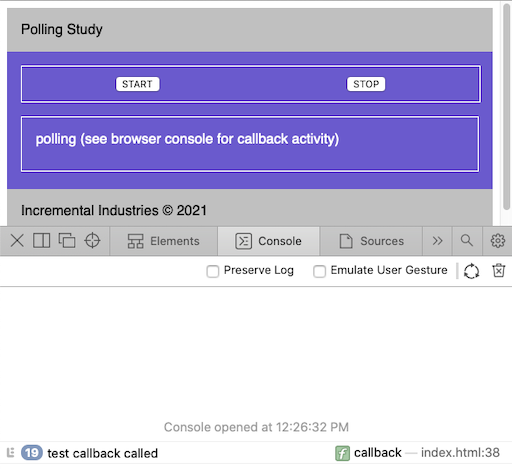

# poller
Like setInterval(cb, msec) but observable and safer since it requires cb completion before next invocation.



## Motivation

I'd like to implement an network status checker that periodically polls the internet for
the existence of a known file.

I liked [this approach](https://gist.github.com/gitdagray/f310be81be217750fc9d2b233e2ae70c#gistcomment-3819167),
but want to add the ability to start and stop polling.

So this is just a fancy wrapper for setTimeout() which captures the timeout id so we can
clear it to stop the polling behavior.

I've also observability semantics to the poller based upon some inspiration from Addy Osmani's cool book,
Learning JavaScript Design Patterns.

When the start button is clicked, the poller's state looks like this:

```stopped`` --> ```starting``` --> ```polling``` 

Once in polling mode, the poller invokes the payload callback periodically until the poller is stopped.

The poller waits for the callback to complete before scheduling another invocation.  This
prevents long-running callbacks that take longer than the configured interval from stacking up.

When the stop button is clicked, poller state becomes:

```polling`` --> ```stopping``` --> ```stopped``` 

Here's a snippet from ```index.html``` like if you're too lazy to click the github link :D

```
  <body>
    <script type="text/javascript" src="./observer-list.js"></script>
    <script type="text/javascript" src="./poller.js"></script>
    <script type="text/javascript" src="./view.js"></script>
    <div id="container">
      <header>
        Polling Study
      </header>
      <main>
        <div id="button-row">
          <button id="start-button">start</button>
          <button id="stop-button">stop</button>
        </div>
        <div id="status">Status</div>
      </main>
      <footer>
        Incremental Industries &copy; 2021
      </footer>
    </div>
    <script type="text/javascript">
      document.addEventListener("DOMContentLoaded", function(event) {

        // Create a view object that defines an update() method.

        let divId = "status"
        let view = new View(divId)

        // Instantiate a poller object with callback and max frequency interval.

        let msec = 2000
        let callback = () => { console.log('test callback called') }
        let poller = new Poller(callback, msec)

        // Register the view as an observer of the poller's state.

        poller.addObserver(view)

        // Enable buttons to control the poller.

        let startButtonEl = document.getElementById("start-button")
        startButtonEl.addEventListener('click', poller.start.bind(poller))

        let stopButtonEl = document.getElementById("stop-button")
        stopButtonEl.addEventListener('click', poller.stop.bind(poller))

      }); 
    </script>
  </body>
```
